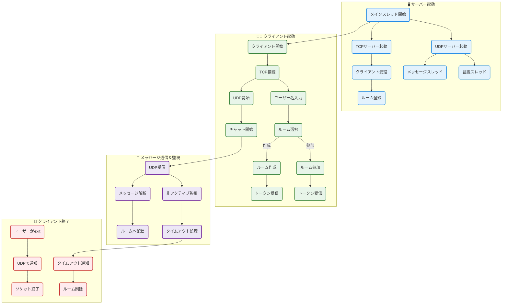

```mermaid
graph TD

%% スタイル定義
classDef server fill:#e3f2fd,stroke:#1e88e5,stroke-width:2px
classDef client fill:#e8f5e9,stroke:#2e7d32,stroke-width:2px
classDef messaging fill:#ede7f6,stroke:#6a1b9a,stroke-width:2px
classDef warning fill:#ffebee,stroke:#c62828,stroke-width:2px

%% サーバー処理
subgraph サーバー[🖥️ サーバー起動]
    S1(メインスレッド開始)
    S2(TCPサーバー起動)
    S3(UDPサーバー起動)
    S4(クライアント受理)
    S5(ルーム登録)
    S6(メッセージスレッド)
    S7(監視スレッド)

    S1 --> S2 --> S4 --> S5
    S1 --> S3 --> S6
    S3 --> S7

    class S1,S2,S3,S4,S5,S6,S7 server
end

%% クライアント処理
subgraph クライアント[🧑‍💻 クライアント起動]
    C1(クライアント開始)
    C2(TCP接続)
    C3(ユーザー名入力)
    C4(ルーム選択)
    C5a(ルーム作成)
    C5b(ルーム参加)
    C6a(トークン受信)
    C6b(トークン受信)
    C7(UDP開始)
    C8(チャット開始)

    C1 --> C2 --> C3 --> C4
    C4 -->|作成| C5a --> C6a
    C4 -->|参加| C5b --> C6b
    C2 --> C7 --> C8

    class C1,C2,C3,C4,C5a,C5b,C6a,C6b,C7,C8 client
end

%% メッセージ処理
subgraph 通信[💬 メッセージ通信＆監視]
    M1(UDP受信)
    M2(メッセージ解析)
    M3(ルームへ配信)
    M4(非アクティブ監視)
    M5(タイムアウト処理)

    M1 --> M2 --> M3
    M1 --> M4 --> M5

    class M1,M2,M3,M4,M5 messaging
end

%% 終了処理
subgraph 終了[🚪 クライアント終了]
    E1(ユーザーがexit)
    E2(UDPで通知)
    E3(ソケット終了)
    E4(タイムアウト通知)
    E5(ルーム削除)

    E1 --> E2 --> E3
    E4 --> E5

    class E1,E2,E3,E4,E5 warning
end

%% 接続の流れ（簡略）
S1 --> C1
C8 --> M1
M5 --> E4
```

