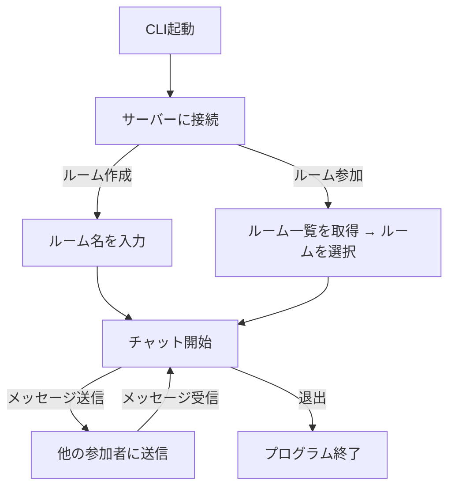

```mermaid
graph TD
    A[CLI起動] --> B[サーバーに接続]
    B -->|ルーム作成| C[ルーム名を入力]
    B -->|ルーム参加| D[ルーム一覧を取得 → ルームを選択]
    
    C --> E[チャット開始]
    D --> E
    
    E -->|メッセージ送信| F[他の参加者に送信]
    F -->|メッセージ受信| E
    
    E -->|退出| G[プログラム終了]
```

