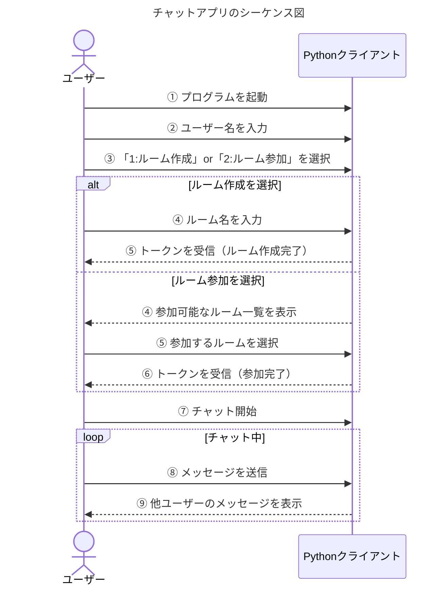
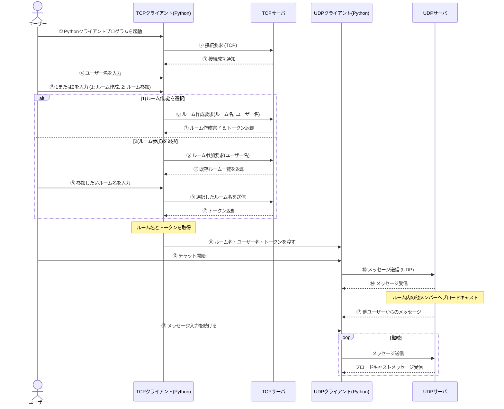

```mermaid
sequenceDiagram
    title チャットアプリのシーケンス図

    actor ユーザー
    participant クライアント as Pythonクライアント

    %% --- 起動フェーズ ---
    ユーザー->>クライアント: ① プログラムを起動
    ユーザー->>クライアント: ② ユーザー名を入力
    ユーザー->>クライアント: ③ 「1:ルーム作成」or「2:ルーム参加」を選択

    %% --- ルーム選択フェーズ ---
    alt ルーム作成を選択
        ユーザー->>クライアント: ④ ルーム名を入力
        クライアント-->>ユーザー: ⑤ トークンを受信（ルーム作成完了）
    else ルーム参加を選択
        クライアント-->>ユーザー: ④ 参加可能なルーム一覧を表示
        ユーザー->>クライアント: ⑤ 参加するルームを選択
        クライアント-->>ユーザー: ⑥ トークンを受信（参加完了）
    end

    %% --- チャットフェーズ ---
    ユーザー->>クライアント: ⑦ チャット開始

    loop チャット中
        ユーザー->>クライアント: ⑧ メッセージを送信
        クライアント-->>ユーザー: ⑨ 他ユーザーのメッセージを表示
    end


```

```mermaid
sequenceDiagram
    actor ユーザー
    participant TCPクライアント as TCPクライアント(Python)
    participant TCPサーバ as TCPサーバ
    participant UDPクライアント as UDPクライアント(Python)
    participant UDPサーバ as UDPサーバ

    ユーザー->>TCPクライアント: ① Pythonクライアントプログラムを起動
    TCPクライアント->>TCPサーバ: ② 接続要求 (TCP)
    TCPサーバ-->>TCPクライアント: ③ 接続成功通知

    ユーザー->>TCPクライアント: ④ ユーザー名を入力
    ユーザー->>TCPクライアント: ⑤ 1または2を入力 (1: ルーム作成, 2: ルーム参加)

    alt 1(ルーム作成)を選択
        TCPクライアント->>TCPサーバ: ⑥ ルーム作成要求(ルーム名, ユーザー名)
        TCPサーバ-->>TCPクライアント: ⑦ ルーム作成完了 & トークン返却
    else 2(ルーム参加)を選択
        TCPクライアント->>TCPサーバ: ⑥ ルーム参加要求(ユーザー名)
        TCPサーバ-->>TCPクライアント: ⑦ 既存ルーム一覧を返却
        ユーザー->>TCPクライアント: ⑧ 参加したいルーム名を入力
        TCPクライアント->>TCPサーバ: ⑨ 選択したルーム名を送信
        TCPサーバ-->>TCPクライアント: ⑩ トークン返却
    end

    note over TCPクライアント: ルーム名とトークンを取得
    
    TCPクライアント->>UDPクライアント: ⑪ ルーム名・ユーザー名・トークンを渡す

    ユーザー->>UDPクライアント: ⑫ チャット開始
    UDPクライアント->>UDPサーバ: ⑬ メッセージ送信 (UDP)
    UDPサーバ-->>UDPクライアント: ⑭ メッセージ受信

    note over UDPサーバ: ルーム内の他メンバーへブロードキャスト

    UDPサーバ-->>UDPクライアント: ⑮ 他ユーザーからのメッセージ
    ユーザー->>UDPクライアント: ⑯ メッセージ入力を続ける
    loop 継続
        UDPクライアント->>UDPサーバ: メッセージ送信
        UDPサーバ-->>UDPクライアント: ブロードキャストメッセージ受信
    end
```

