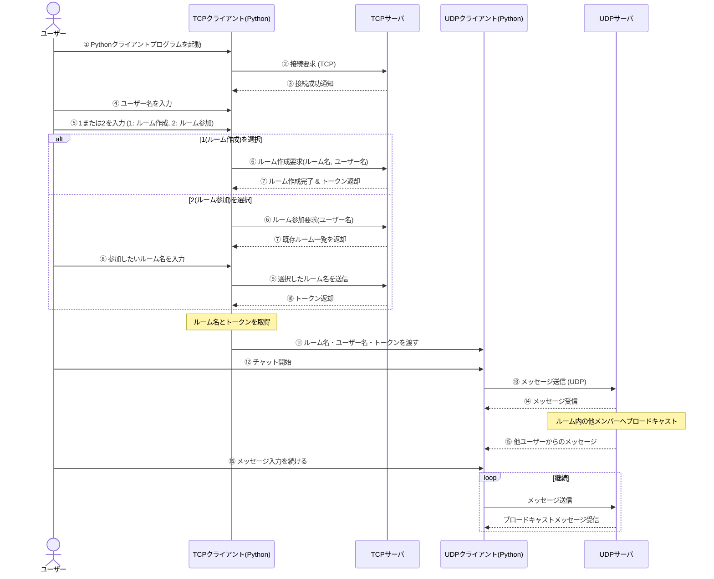
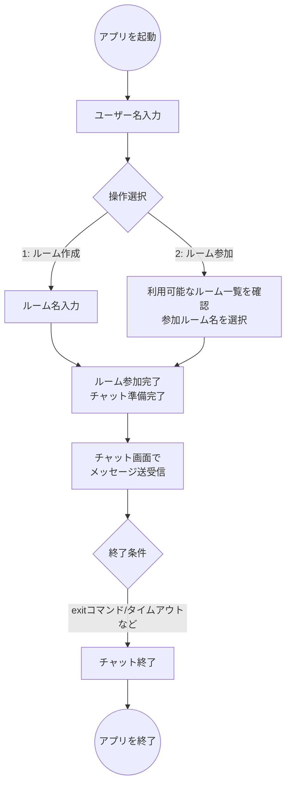

```mermaid
sequenceDiagram
    actor ユーザー
    participant TCPクライアント as TCPクライアント(Python)
    participant TCPサーバ as TCPサーバ
    participant UDPクライアント as UDPクライアント(Python)
    participant UDPサーバ as UDPサーバ

    ユーザー->>TCPクライアント: ① Pythonクライアントプログラムを起動
    TCPクライアント->>TCPサーバ: ② 接続要求 (TCP)
    TCPサーバ-->>TCPクライアント: ③ 接続成功通知

    ユーザー->>TCPクライアント: ④ ユーザー名を入力
    ユーザー->>TCPクライアント: ⑤ 1または2を入力 (1: ルーム作成, 2: ルーム参加)

    alt 1(ルーム作成)を選択
        TCPクライアント->>TCPサーバ: ⑥ ルーム作成要求(ルーム名, ユーザー名)
        TCPサーバ-->>TCPクライアント: ⑦ ルーム作成完了 & トークン返却
    else 2(ルーム参加)を選択
        TCPクライアント->>TCPサーバ: ⑥ ルーム参加要求(ユーザー名)
        TCPサーバ-->>TCPクライアント: ⑦ 既存ルーム一覧を返却
        ユーザー->>TCPクライアント: ⑧ 参加したいルーム名を入力
        TCPクライアント->>TCPサーバ: ⑨ 選択したルーム名を送信
        TCPサーバ-->>TCPクライアント: ⑩ トークン返却
    end

    note over TCPクライアント: ルーム名とトークンを取得
    
    TCPクライアント->>UDPクライアント: ⑪ ルーム名・ユーザー名・トークンを渡す

    ユーザー->>UDPクライアント: ⑫ チャット開始
    UDPクライアント->>UDPサーバ: ⑬ メッセージ送信 (UDP)
    UDPサーバ-->>UDPクライアント: ⑭ メッセージ受信

    note over UDPサーバ: ルーム内の他メンバーへブロードキャスト

    UDPサーバ-->>UDPクライアント: ⑮ 他ユーザーからのメッセージ
    ユーザー->>UDPクライアント: ⑯ メッセージ入力を続ける
    loop 継続
        UDPクライアント->>UDPサーバ: メッセージ送信
        UDPサーバ-->>UDPクライアント: ブロードキャストメッセージ受信
    end
```

```mermaid
flowchart TB
    A((アプリを起動)) --> B[ユーザー名入力]
    B --> C{操作選択}
    C --> |1: ルーム作成| D[ルーム名入力]
    C --> |2: ルーム参加| E[利用可能なルーム一覧を確認<br>参加ルーム名を選択]
    D --> F[ルーム作成完了<br>チャット準備完了]
    E --> F[ルーム参加完了<br>チャット準備完了]
    F --> G[チャット画面で<br>メッセージ送受信]
    G --> H{終了条件}
    H --> |exitコマンド/タイムアウトなど| I[チャット終了]
    I --> J((アプリを終了))
```
