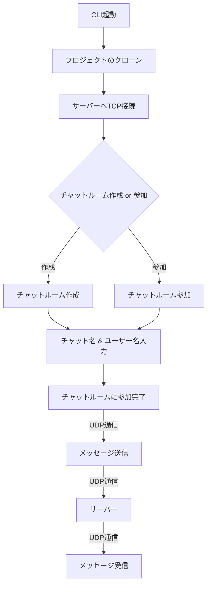

```mermaid
graph TD
    A[CLI起動] --> B[プロジェクトのクローン]
    B --> C[サーバーへTCP接続]
    C --> D{チャットルーム作成 or 参加}
    D -- 作成 --> E[チャットルーム作成]
    D -- 参加 --> F[チャットルーム参加]
    E --> G[チャット名 & ユーザー名入力]
    F --> G
    G --> H[チャットルームに参加完了]
    
    H -->|UDP通信| I[メッセージ送信]
    I -->|UDP通信| J[サーバー]
    J -->|UDP通信| K[メッセージ受信]
```
