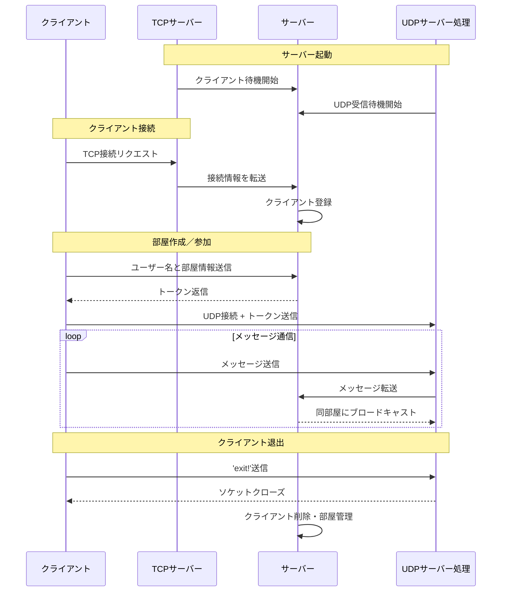

```mermaid
sequenceDiagram
    %% 登場人物の整理（役割ごと）
    participant Client as クライアント
    participant TCPServer as TCPサーバー
    participant MainServer as サーバー
    participant UDPHandler as UDPサーバー処理

    %% --- 起動フェーズ ---
    Note over TCPServer, UDPHandler: サーバー起動
    TCPServer->>MainServer: クライアント待機開始
    UDPHandler->>MainServer: UDP受信待機開始

    %% --- 接続フェーズ ---
    Note over Client, TCPServer: クライアント接続
    Client->>TCPServer: TCP接続リクエスト
    TCPServer->>MainServer: 接続情報を転送
    MainServer->>MainServer: クライアント登録

    %% --- 認証・部屋処理フェーズ ---
    Note over Client, MainServer: 部屋作成／参加
    Client->>MainServer: ユーザー名と部屋情報送信
    MainServer-->>Client: トークン返信
    Client->>UDPHandler: UDP接続 + トークン送信

    %% --- メッセージ通信フェーズ ---
    loop メッセージ通信
        Client->>UDPHandler: メッセージ送信
        UDPHandler->>MainServer: メッセージ転送
        MainServer-->>UDPHandler: 同部屋にブロードキャスト
    end

    %% --- クライアント終了処理 ---
    Note over Client, UDPHandler: クライアント退出
    Client->>UDPHandler: 'exit!'送信
    UDPHandler-->>Client: ソケットクローズ
    MainServer->>MainServer: クライアント削除・部屋管理
```
