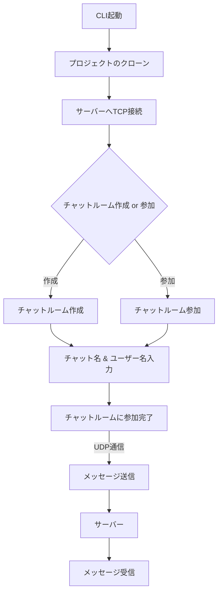

```mermaid
graph TD
    %% メインの処理
    A[CLI起動] --> B[プロジェクトのクローン] --> C[サーバーへTCP接続]
    
    %% チャットルーム作成 or 参加
    C --> D{チャットルーム作成 or 参加}
    D -- 作成 --> E[チャットルーム作成]
    D -- 参加 --> F[チャットルーム参加]
    
    %% ユーザー名＆チャット名入力
    E --> G[チャット名 & ユーザー名入力]
    F --> G
    G --> H[チャットルームに参加完了]

    %% メッセージ送信・受信（コンパクトにまとめる）
    H -->|UDP通信| I[メッセージ送信]
    I --> J[サーバー] 
    J --> K[メッセージ受信]
```
