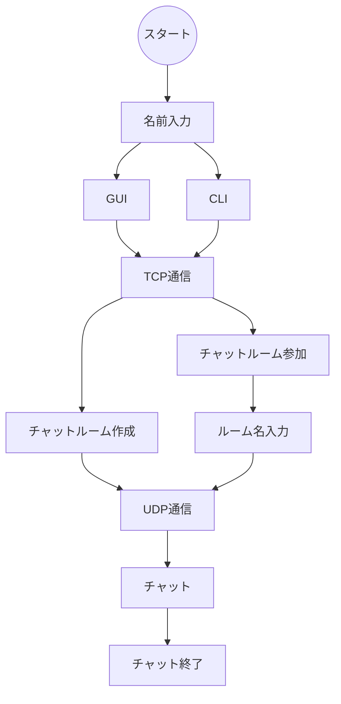

```mermaid
flowchart TB
    A((スタート)) --> B[名前入力]
    B --> C[GUI]
    B --> D[CLI]
    C --> E[TCP通信]
    D --> E[TCP通信]
    E --> F[チャットルーム作成]
    E --> G[チャットルーム参加]
    G --> H[ルーム名入力]
    F --> I[UDP通信]
    H --> I[UDP通信]
    I --> J[チャット]
    J --> K[チャット終了]
```
