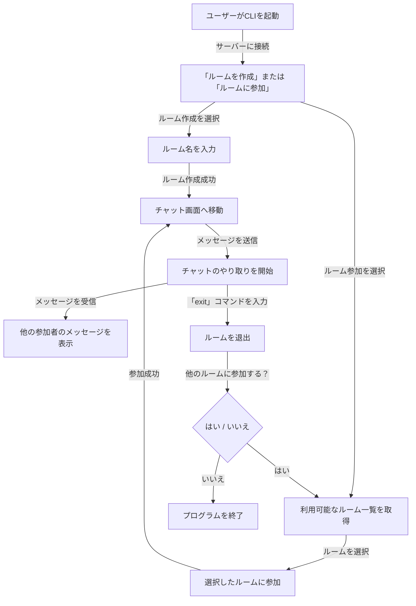

```mermaid
graph TD
    A[ユーザーがCLIを起動] -->|サーバーに接続| B[「ルームを作成」または「ルームに参加」]
    
    B -- ルーム作成を選択 --> C[ルーム名を入力]
    C -->|ルーム作成成功| D[チャット画面へ移動]
    
    B -- ルーム参加を選択 --> E[利用可能なルーム一覧を取得]
    E -->|ルームを選択| F[選択したルームに参加]
    F -->|参加成功| D

    D -->|メッセージを送信| G[チャットのやり取りを開始]
    G -->|メッセージを受信| H[他の参加者のメッセージを表示]
    
    G -->|「exit」コマンドを入力| I[ルームを退出]
    I -->|他のルームに参加する？| J{はい / いいえ}
    
    J -- はい --> E
    J -- いいえ --> K[プログラムを終了]
```

