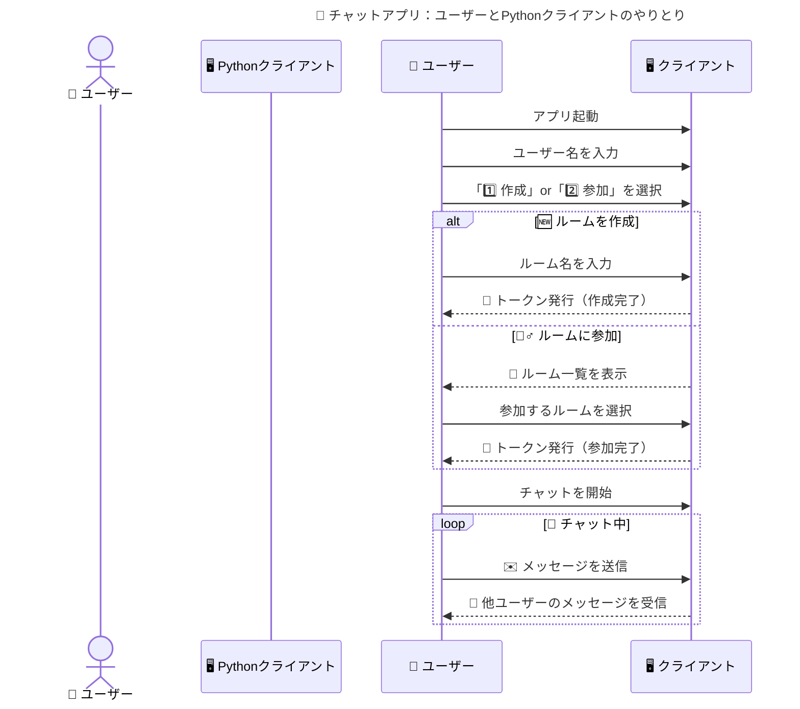
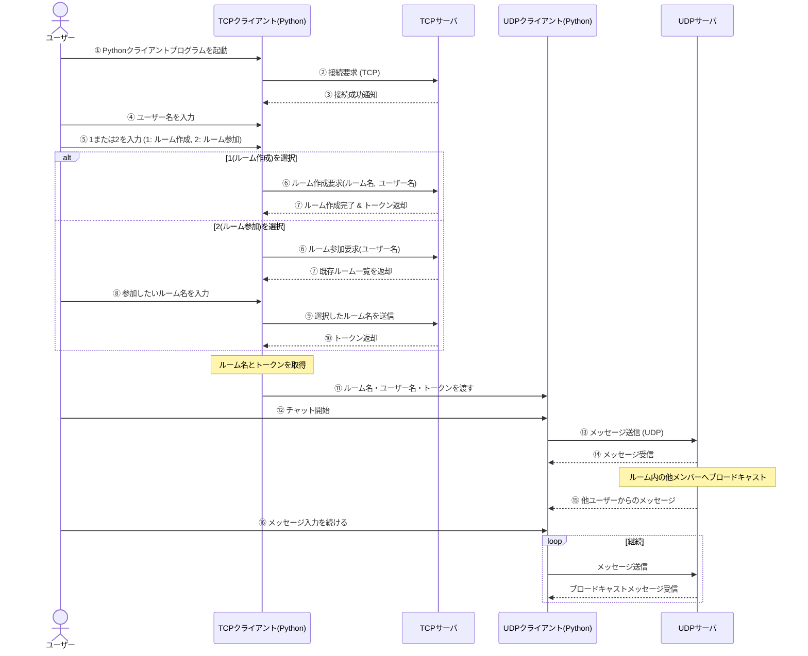

```mermaid
sequenceDiagram
    title 💬 チャットアプリ：ユーザーとPythonクライアントのやりとり

    actor ユーザー as 👤 ユーザー
    participant クライアント as 🖥️ Pythonクライアント

    %% === 🚀 起動フェーズ ===
    👤 ユーザー->>🖥️ クライアント: アプリ起動
    👤 ユーザー->>🖥️ クライアント: ユーザー名を入力
    👤 ユーザー->>🖥️ クライアント: 「1️⃣ 作成」or「2️⃣ 参加」を選択

    %% === 🏠 ルーム選択フェーズ ===
    alt 🆕 ルームを作成
        👤 ユーザー->>🖥️ クライアント: ルーム名を入力
        🖥️ クライアント-->>👤 ユーザー: 🔑 トークン発行（作成完了）
    else 🏃‍♂️ ルームに参加
        🖥️ クライアント-->>👤 ユーザー: 📜 ルーム一覧を表示
        👤 ユーザー->>🖥️ クライアント: 参加するルームを選択
        🖥️ クライアント-->>👤 ユーザー: 🔑 トークン発行（参加完了）
    end

    %% === 💬 チャットフェーズ ===
    👤 ユーザー->>🖥️ クライアント: チャットを開始

    loop 🔁 チャット中
        👤 ユーザー->>🖥️ クライアント: ✉️ メッセージを送信
        🖥️ クライアント-->>👤 ユーザー: 📨 他ユーザーのメッセージを受信
    end

```

```mermaid
sequenceDiagram
    actor ユーザー
    participant TCPクライアント as TCPクライアント(Python)
    participant TCPサーバ as TCPサーバ
    participant UDPクライアント as UDPクライアント(Python)
    participant UDPサーバ as UDPサーバ

    ユーザー->>TCPクライアント: ① Pythonクライアントプログラムを起動
    TCPクライアント->>TCPサーバ: ② 接続要求 (TCP)
    TCPサーバ-->>TCPクライアント: ③ 接続成功通知

    ユーザー->>TCPクライアント: ④ ユーザー名を入力
    ユーザー->>TCPクライアント: ⑤ 1または2を入力 (1: ルーム作成, 2: ルーム参加)

    alt 1(ルーム作成)を選択
        TCPクライアント->>TCPサーバ: ⑥ ルーム作成要求(ルーム名, ユーザー名)
        TCPサーバ-->>TCPクライアント: ⑦ ルーム作成完了 & トークン返却
    else 2(ルーム参加)を選択
        TCPクライアント->>TCPサーバ: ⑥ ルーム参加要求(ユーザー名)
        TCPサーバ-->>TCPクライアント: ⑦ 既存ルーム一覧を返却
        ユーザー->>TCPクライアント: ⑧ 参加したいルーム名を入力
        TCPクライアント->>TCPサーバ: ⑨ 選択したルーム名を送信
        TCPサーバ-->>TCPクライアント: ⑩ トークン返却
    end

    note over TCPクライアント: ルーム名とトークンを取得
    
    TCPクライアント->>UDPクライアント: ⑪ ルーム名・ユーザー名・トークンを渡す

    ユーザー->>UDPクライアント: ⑫ チャット開始
    UDPクライアント->>UDPサーバ: ⑬ メッセージ送信 (UDP)
    UDPサーバ-->>UDPクライアント: ⑭ メッセージ受信

    note over UDPサーバ: ルーム内の他メンバーへブロードキャスト

    UDPサーバ-->>UDPクライアント: ⑮ 他ユーザーからのメッセージ
    ユーザー->>UDPクライアント: ⑯ メッセージ入力を続ける
    loop 継続
        UDPクライアント->>UDPサーバ: メッセージ送信
        UDPサーバ-->>UDPクライアント: ブロードキャストメッセージ受信
    end
```

