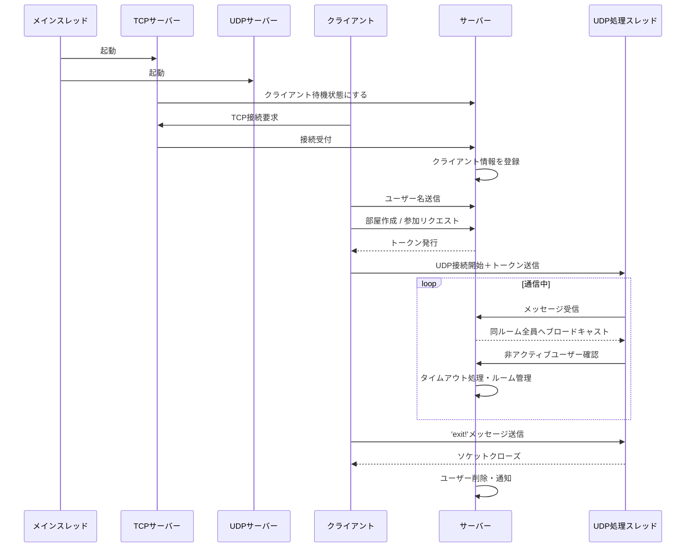

```mermaid
sequenceDiagram
    %% 登場人物
    participant MainThread as メインスレッド
    participant TCPServer as TCPサーバー
    participant UDPServer as UDPサーバー
    participant Client as クライアント
    participant CoreServer as サーバー
    participant UDPHandler as UDP処理スレッド

    %% フェーズ1：サーバー起動
    MainThread->>TCPServer: 起動
    MainThread->>UDPServer: 起動
    TCPServer->>CoreServer: クライアント待機状態にする

    %% フェーズ2：クライアント接続
    Client->>TCPServer: TCP接続要求
    TCPServer->>CoreServer: 接続受付
    CoreServer->>CoreServer: クライアント情報を登録

    %% フェーズ3：ルーム参加とUDP通信
    Client->>CoreServer: ユーザー名送信
    Client->>CoreServer: 部屋作成 / 参加リクエスト
    CoreServer-->>Client: トークン発行
    Client->>UDPHandler: UDP接続開始＋トークン送信

    %% フェーズ4：リアルタイム通信・終了処理
    loop 通信中
        UDPHandler->>CoreServer: メッセージ受信
        CoreServer-->>UDPHandler: 同ルーム全員へブロードキャスト
        UDPHandler->>CoreServer: 非アクティブユーザー確認
        CoreServer->>CoreServer: タイムアウト処理・ルーム管理
    end

    %% クライアント終了処理
    Client->>UDPHandler: 'exit!'メッセージ送信
    UDPHandler-->>Client: ソケットクローズ
    CoreServer->>CoreServer: ユーザー削除・通知
```
