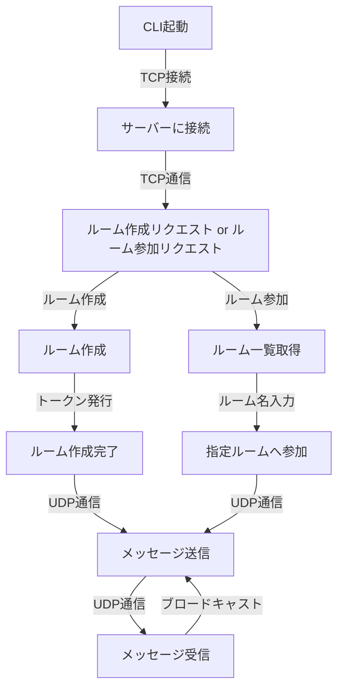

```mermaid
graph TD
    A[CLI起動] -->|TCP接続| B[サーバーに接続]
    B -->|TCP通信| C[ルーム作成リクエスト or ルーム参加リクエスト]

    C -- ルーム作成 --> D[ルーム作成]
    C -- ルーム参加 --> E[ルーム一覧取得]

    D -->|トークン発行| F[ルーム作成完了]
    E -->|ルーム名入力| G[指定ルームへ参加]

    F -->|UDP通信| H[メッセージ送信]
    G -->|UDP通信| H

    H -->|UDP通信| I[メッセージ受信]
    I -->|ブロードキャスト| H
```

