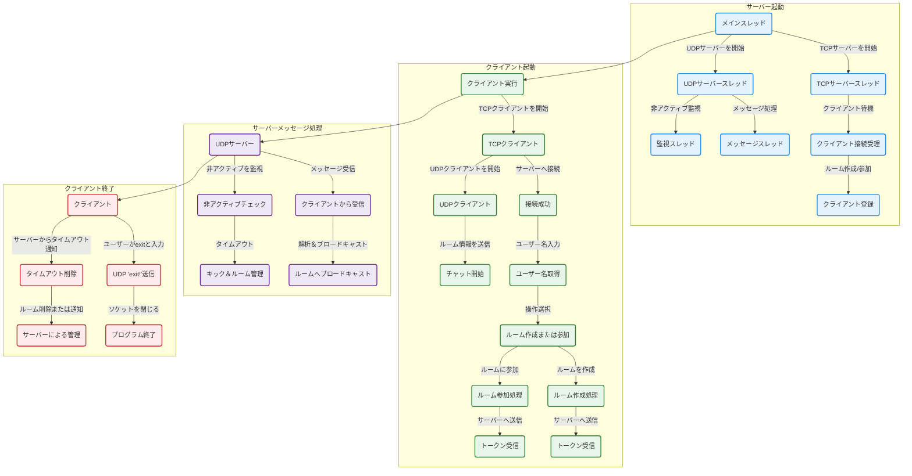

```mermaid
graph TD

classDef server fill:#e3f2fd,stroke:#1e88e5,stroke-width:2px
classDef client fill:#e8f5e9,stroke:#2e7d32,stroke-width:2px
classDef messaging fill:#ede7f6,stroke:#6a1b9a,stroke-width:2px
classDef warning fill:#ffebee,stroke:#c62828,stroke-width:2px

subgraph サーバー起動
    A1(メインスレッド)
    A2(TCPサーバースレッド)
    A3(UDPサーバースレッド)
    A4(クライアント接続受理)
    A5(クライアント登録)
    A6(メッセージスレッド)
    A7(監視スレッド)

    A1 -->|TCPサーバーを開始| A2
    A1 -->|UDPサーバーを開始| A3
    A2 -->|クライアント待機| A4
    A4 -->|ルーム作成/参加| A5
    A3 -->|メッセージ処理| A6
    A3 -->|非アクティブ監視| A7

    class A1,A2,A3,A4,A5,A6,A7 server
end

subgraph クライアント起動
    B1(クライアント実行)
    B2(TCPクライアント)
    B3(接続成功)
    B4(ユーザー名取得)
    B5(ルーム作成または参加)
    B6(ルーム作成処理)
    B7(トークン受信)
    B8(ルーム参加処理)
    B9(トークン受信)
    B10(UDPクライアント)
    B11(チャット開始)

    B1 -->|TCPクライアントを開始| B2
    B2 -->|サーバーへ接続| B3
    B3 -->|ユーザー名入力| B4
    B4 -->|操作選択| B5
    B5 -->|ルームを作成| B6
    B6 -->|サーバーへ送信| B7
    B5 -->|ルームに参加| B8
    B8 -->|サーバーへ送信| B9
    B2 -->|UDPクライアントを開始| B10
    B10 -->|ルーム情報を送信| B11

    class B1,B2,B3,B4,B5,B6,B7,B8,B9,B10,B11 client
end

subgraph サーバーメッセージ処理
    C1(UDPサーバー)
    C2(クライアントから受信)
    C3(ルームへブロードキャスト)
    C4(非アクティブチェック)
    C5(キック＆ルーム管理)

    C1 -->|メッセージ受信| C2
    C2 -->|解析＆ブロードキャスト| C3
    C1 -->|非アクティブを監視| C4
    C4 -->|タイムアウト| C5

    class C1,C2,C3,C4,C5 messaging
end

subgraph クライアント終了
    D1(クライアント)
    D2(UDP 'exit!'送信)
    D3(プログラム終了)
    D4(タイムアウト削除)
    D5(サーバーによる管理)

    D1 -->|ユーザーがexitと入力| D2
    D2 -->|ソケットを閉じる| D3
    D1 -->|サーバーからタイムアウト通知| D4
    D4 -->|ルーム削除または通知| D5

    class D1,D2,D3,D4,D5 warning
end

A1 --> B1
B1 --> C1
C1 --> D1
```
