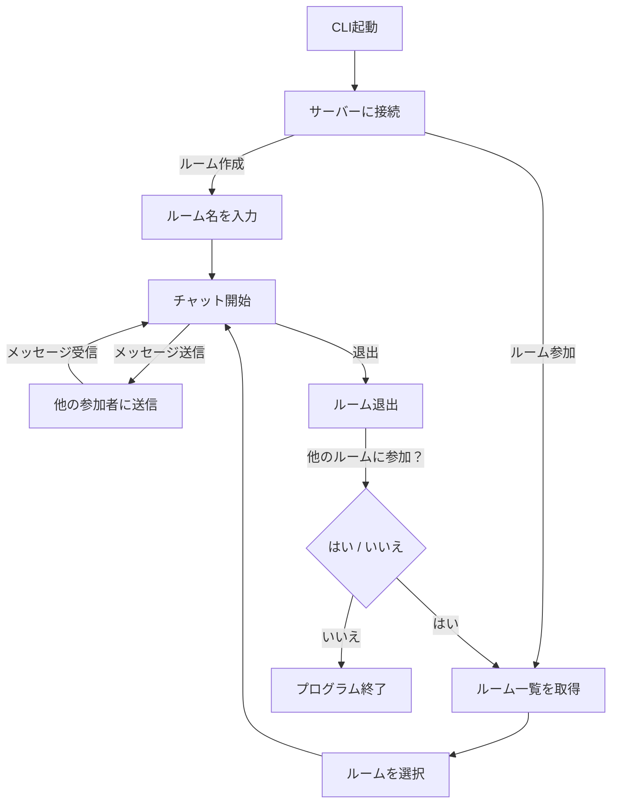

```mermaid
graph TD
    A[CLI起動] --> B[サーバーに接続]
    B -->|ルーム作成| C[ルーム名を入力]
    B -->|ルーム参加| D[ルーム一覧を取得]
    D --> E[ルームを選択]

    C --> F[チャット開始]
    E --> F

    F -->|メッセージ送信| G[他の参加者に送信]
    G -->|メッセージ受信| F

    F -->|退出| H[ルーム退出]
    H -->|他のルームに参加？| I{はい / いいえ}
    I -- はい --> D
    I -- いいえ --> J[プログラム終了]
```

