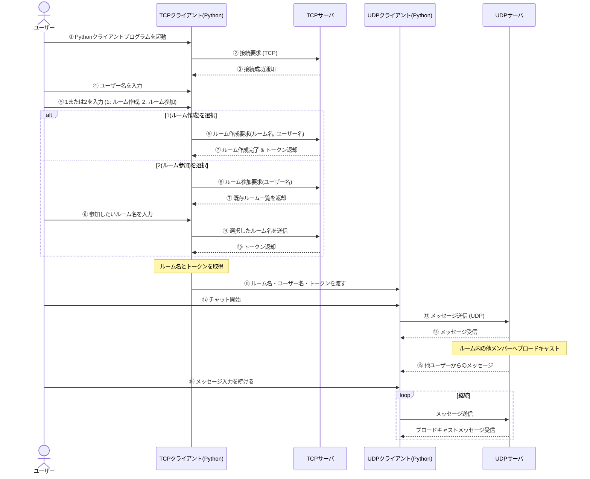
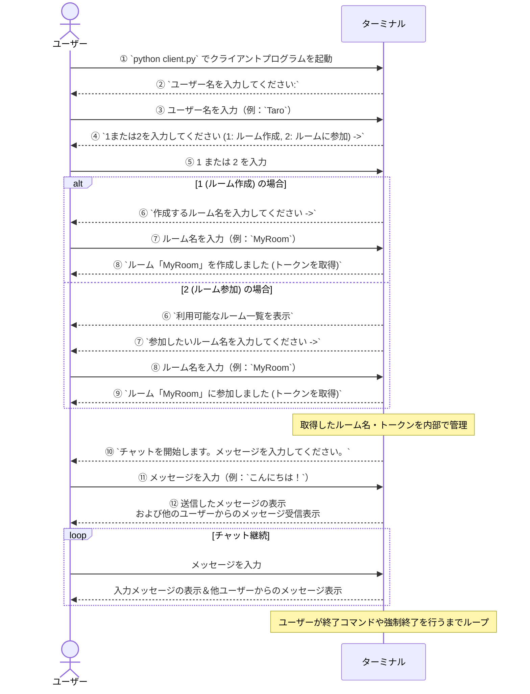

```mermaid
sequenceDiagram
    actor ユーザー
    participant TCPクライアント as TCPクライアント(Python)
    participant TCPサーバ as TCPサーバ
    participant UDPクライアント as UDPクライアント(Python)
    participant UDPサーバ as UDPサーバ

    ユーザー->>TCPクライアント: ① Pythonクライアントプログラムを起動
    TCPクライアント->>TCPサーバ: ② 接続要求 (TCP)
    TCPサーバ-->>TCPクライアント: ③ 接続成功通知

    ユーザー->>TCPクライアント: ④ ユーザー名を入力
    ユーザー->>TCPクライアント: ⑤ 1または2を入力 (1: ルーム作成, 2: ルーム参加)

    alt 1(ルーム作成)を選択
        TCPクライアント->>TCPサーバ: ⑥ ルーム作成要求(ルーム名, ユーザー名)
        TCPサーバ-->>TCPクライアント: ⑦ ルーム作成完了 & トークン返却
    else 2(ルーム参加)を選択
        TCPクライアント->>TCPサーバ: ⑥ ルーム参加要求(ユーザー名)
        TCPサーバ-->>TCPクライアント: ⑦ 既存ルーム一覧を返却
        ユーザー->>TCPクライアント: ⑧ 参加したいルーム名を入力
        TCPクライアント->>TCPサーバ: ⑨ 選択したルーム名を送信
        TCPサーバ-->>TCPクライアント: ⑩ トークン返却
    end

    note over TCPクライアント: ルーム名とトークンを取得
    
    TCPクライアント->>UDPクライアント: ⑪ ルーム名・ユーザー名・トークンを渡す

    ユーザー->>UDPクライアント: ⑫ チャット開始
    UDPクライアント->>UDPサーバ: ⑬ メッセージ送信 (UDP)
    UDPサーバ-->>UDPクライアント: ⑭ メッセージ受信

    note over UDPサーバ: ルーム内の他メンバーへブロードキャスト

    UDPサーバ-->>UDPクライアント: ⑮ 他ユーザーからのメッセージ
    ユーザー->>UDPクライアント: ⑯ メッセージ入力を続ける
    loop 継続
        UDPクライアント->>UDPサーバ: メッセージ送信
        UDPサーバ-->>UDPクライアント: ブロードキャストメッセージ受信
    end
```

```mermaid
sequenceDiagram
    actor ユーザー
    participant ターミナル

    ユーザー->>ターミナル: ① `python client.py` でクライアントプログラムを起動
    ターミナル-->>ユーザー: ② `ユーザー名を入力してください:`
    ユーザー->>ターミナル: ③ ユーザー名を入力（例：`Taro`）
    ターミナル-->>ユーザー: ④ `1または2を入力してください (1: ルーム作成, 2: ルームに参加) ->`
    ユーザー->>ターミナル: ⑤ 1 または 2 を入力

    alt 1 (ルーム作成) の場合
        ターミナル-->>ユーザー: ⑥ `作成するルーム名を入力してください ->`
        ユーザー->>ターミナル: ⑦ ルーム名を入力（例：`MyRoom`）
        ターミナル-->>ユーザー: ⑧ `ルーム「MyRoom」を作成しました (トークンを取得)`
    else 2 (ルーム参加) の場合
        ターミナル-->>ユーザー: ⑥ `利用可能なルーム一覧を表示`
        ターミナル-->>ユーザー: ⑦ `参加したいルーム名を入力してください ->`
        ユーザー->>ターミナル: ⑧ ルーム名を入力（例：`MyRoom`）
        ターミナル-->>ユーザー: ⑨ `ルーム「MyRoom」に参加しました (トークンを取得)`
    end

    note over ターミナル: 取得したルーム名・トークンを内部で管理

    ターミナル-->>ユーザー: ⑩ `チャットを開始します。メッセージを入力してください。`
    ユーザー->>ターミナル: ⑪ メッセージを入力（例：`こんにちは！`）
    ターミナル-->>ユーザー: ⑫ 送信したメッセージの表示<br/>および他のユーザーからのメッセージ受信表示

    loop チャット継続
        ユーザー->>ターミナル: メッセージを入力
        ターミナル-->>ユーザー: 入力メッセージの表示＆他ユーザーからのメッセージ表示
    end

    note over ターミナル: ユーザーが終了コマンドや強制終了を行うまでループ
```
