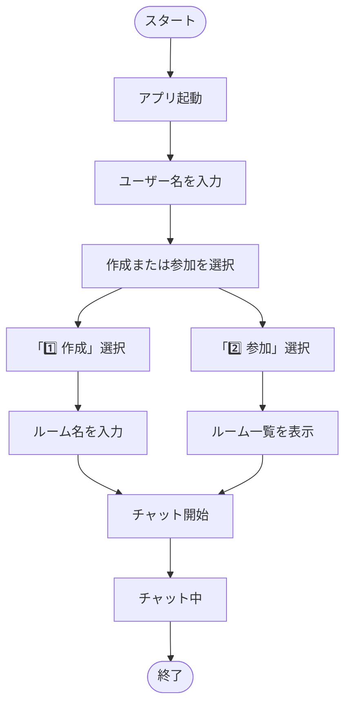
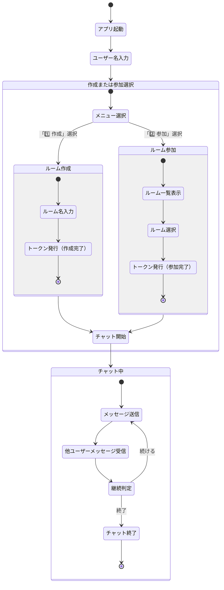
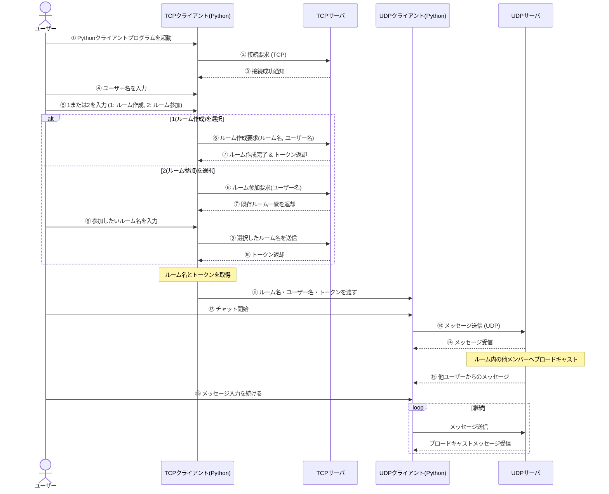

```mermaid
flowchart TD
    Start([スタート])
    起動[アプリ起動]
    入力[ユーザー名を入力]
    選択[作成または参加を選択]

    作成1[「1️⃣ 作成」選択]
    ルーム名入力[ルーム名を入力]

    参加2[「2️⃣ 参加」選択]
    ルーム一覧[ルーム一覧を表示]

    チャット開始[チャット開始]
    チャット中[チャット中]
    End([終了])

    Start --> 起動 --> 入力 --> 選択

    選択 --> 作成1 --> ルーム名入力 --> チャット開始
    選択 --> 参加2 --> ルーム一覧 --> チャット開始

    チャット開始 --> チャット中 --> End

```

```mermaid
stateDiagram-v2
    [*] --> アプリ起動

    アプリ起動 --> ユーザー名入力
    ユーザー名入力 --> 作成または参加選択

    state 作成または参加選択 {
        [*] --> メニュー選択
        メニュー選択 --> ルーム作成 : 「1️⃣ 作成」選択
        メニュー選択 --> ルーム参加 : 「2️⃣ 参加」選択

        state ルーム作成 {
            [*] --> ルーム名入力
            ルーム名入力 --> トークン発行（作成完了）
            トークン発行（作成完了） --> [*]
        }

        state ルーム参加 {
            [*] --> ルーム一覧表示
            ルーム一覧表示 --> ルーム選択
            ルーム選択 --> トークン発行（参加完了）
            トークン発行（参加完了） --> [*]
        }

        ルーム作成 --> チャット開始
        ルーム参加 --> チャット開始
    }

    チャット開始 --> チャット中

    state チャット中 {
        [*] --> メッセージ送信
        メッセージ送信 --> 他ユーザーメッセージ受信
        他ユーザーメッセージ受信 --> 継続判定

        state 継続判定 <<choice>>
        継続判定 --> メッセージ送信 : 続ける
        継続判定 --> チャット終了 : 終了

        チャット終了 --> [*]
    }
```

```mermaid
sequenceDiagram
    actor ユーザー
    participant TCPクライアント as TCPクライアント(Python)
    participant TCPサーバ as TCPサーバ
    participant UDPクライアント as UDPクライアント(Python)
    participant UDPサーバ as UDPサーバ

    ユーザー->>TCPクライアント: ① Pythonクライアントプログラムを起動
    TCPクライアント->>TCPサーバ: ② 接続要求 (TCP)
    TCPサーバ-->>TCPクライアント: ③ 接続成功通知

    ユーザー->>TCPクライアント: ④ ユーザー名を入力
    ユーザー->>TCPクライアント: ⑤ 1または2を入力 (1: ルーム作成, 2: ルーム参加)

    alt 1(ルーム作成)を選択
        TCPクライアント->>TCPサーバ: ⑥ ルーム作成要求(ルーム名, ユーザー名)
        TCPサーバ-->>TCPクライアント: ⑦ ルーム作成完了 & トークン返却
    else 2(ルーム参加)を選択
        TCPクライアント->>TCPサーバ: ⑥ ルーム参加要求(ユーザー名)
        TCPサーバ-->>TCPクライアント: ⑦ 既存ルーム一覧を返却
        ユーザー->>TCPクライアント: ⑧ 参加したいルーム名を入力
        TCPクライアント->>TCPサーバ: ⑨ 選択したルーム名を送信
        TCPサーバ-->>TCPクライアント: ⑩ トークン返却
    end

    note over TCPクライアント: ルーム名とトークンを取得
    
    TCPクライアント->>UDPクライアント: ⑪ ルーム名・ユーザー名・トークンを渡す

    ユーザー->>UDPクライアント: ⑫ チャット開始
    UDPクライアント->>UDPサーバ: ⑬ メッセージ送信 (UDP)
    UDPサーバ-->>UDPクライアント: ⑭ メッセージ受信

    note over UDPサーバ: ルーム内の他メンバーへブロードキャスト

    UDPサーバ-->>UDPクライアント: ⑮ 他ユーザーからのメッセージ
    ユーザー->>UDPクライアント: ⑯ メッセージ入力を続ける
    loop 継続
        UDPクライアント->>UDPサーバ: メッセージ送信
        UDPサーバ-->>UDPクライアント: ブロードキャストメッセージ受信
    end
```

