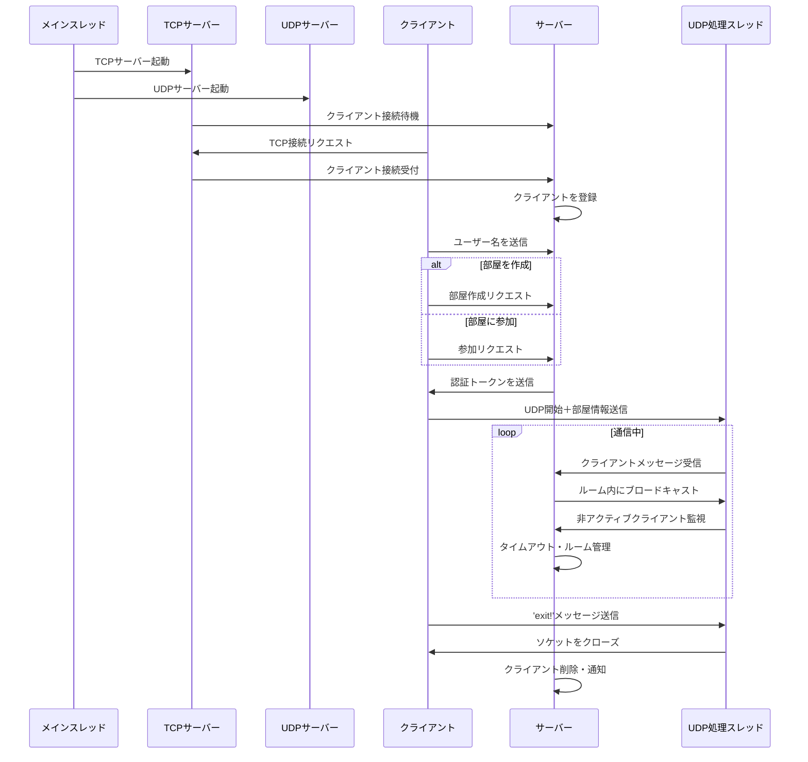

```mermaid
sequenceDiagram
    participant メインスレッド
    participant TCPサーバー
    participant UDPサーバー
    participant クライアント
    participant サーバー
    participant UDP処理スレッド

    %% サーバー起動処理
    メインスレッド->>TCPサーバー: TCPサーバー起動
    メインスレッド->>UDPサーバー: UDPサーバー起動
    TCPサーバー->>サーバー: クライアント接続待機

    %% クライアント接続と認証
    クライアント->>TCPサーバー: TCP接続リクエスト
    TCPサーバー->>サーバー: クライアント接続受付
    サーバー->>サーバー: クライアントを登録

    %% クライアントの部屋作成または参加
    クライアント->>サーバー: ユーザー名を送信
    alt 部屋を作成
        クライアント->>サーバー: 部屋作成リクエスト
    else 部屋に参加
        クライアント->>サーバー: 参加リクエスト
    end
    サーバー->>クライアント: 認証トークンを送信

    %% UDP通信開始
    クライアント->>UDP処理スレッド: UDP開始＋部屋情報送信

    %% メッセージ送受信処理
    loop 通信中
        UDP処理スレッド->>サーバー: クライアントメッセージ受信
        サーバー->>UDP処理スレッド: ルーム内にブロードキャスト
        UDP処理スレッド->>サーバー: 非アクティブクライアント監視
        サーバー->>サーバー: タイムアウト・ルーム管理
    end

    %% クライアント終了処理
    クライアント->>UDP処理スレッド: 'exit!'メッセージ送信
    UDP処理スレッド->>クライアント: ソケットをクローズ
    サーバー->>サーバー: クライアント削除・通知
```
