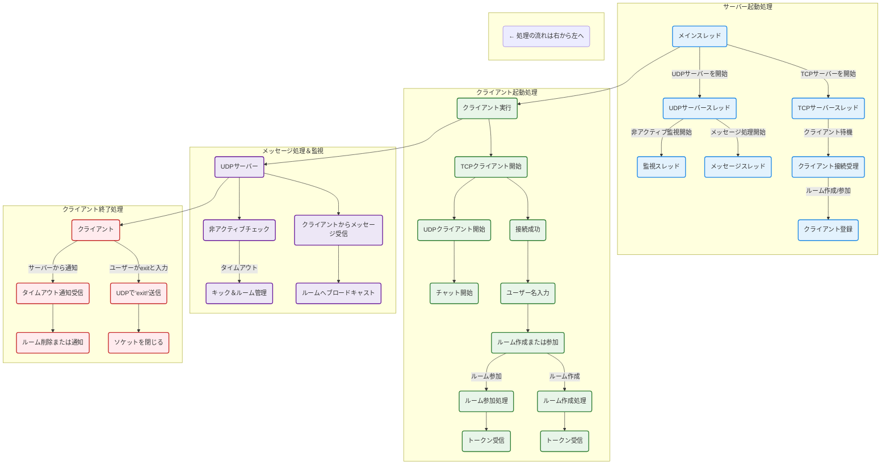
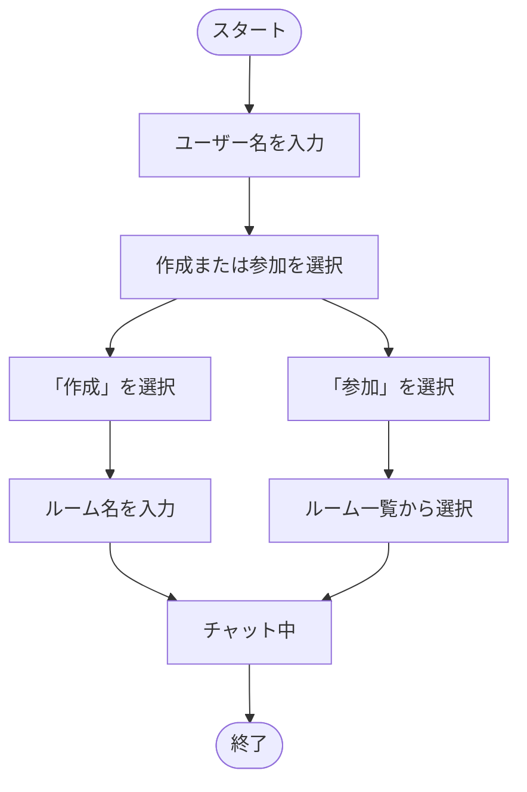
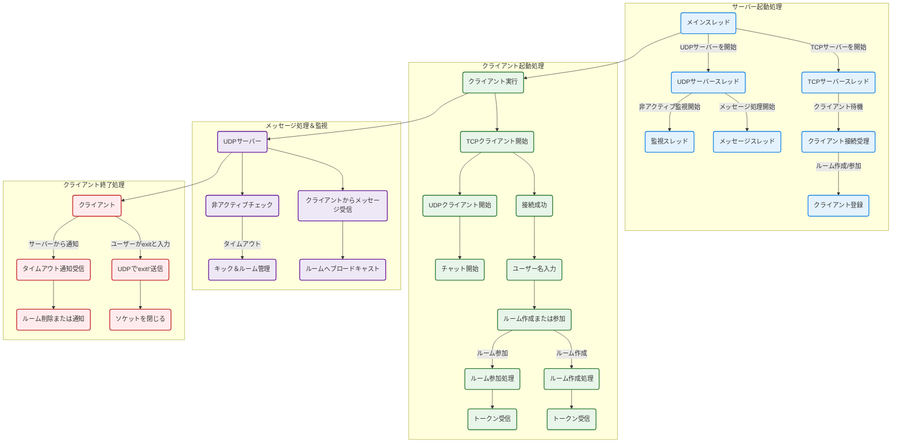
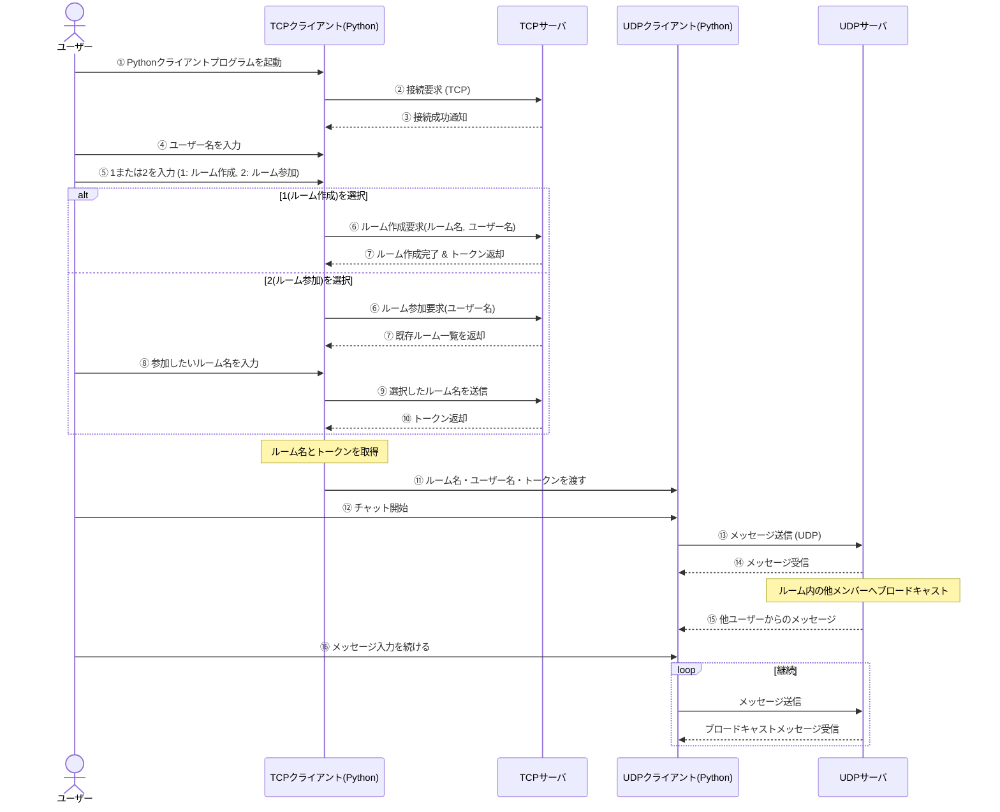

```mermaid
flowchart TD
    subgraph 初期化
        A1[FoodItem の準備<br/>(具象クラス定義、CATEGORY定数・静的メソッド)]
        A2[Person の生成<br/>(Customer、Employee)]
        A3[Restaurant の構築<br/>(メニュー & スタッフ登録)]
    end

    subgraph 顧客注文の開始
        B1[興味カテゴリの取得<br/>(Customer: interestedCategories())]
        B2[注文リクエストの受付]
    end

    subgraph レジ担当による注文受付
        C1[order() メソッドの実行<br/>(FoodItem 選択)]
        C2[注文作成のシミュレーション<br/>("the cashier John created a food order")]
    end

    subgraph FoodOrder の生成と委任
        D1[FoodOrder の生成<br/>(注文内容: FoodItem リスト)]
        D2[シェフへの委任<br/>(調理: "the chef William cooked a Pizza")]
    end

    subgraph 請求書（Invoice）の生成
        E1[Invoice の作成]
        E2[Invoice の内容<br/>(最終価格、注文時間、調理時間)]
    end

    subgraph 注文処理の完了
        F[order() の返り値<br/>(生成された Invoice オブジェクト)]
    end

    %% フローの接続
    A1 --> A2
    A2 --> A3
    A3 --> B1
    B1 --> B2
    B2 --> C1
    C1 --> C2
    C2 --> D1
    D1 --> D2
    D2 --> E1
    E1 --> E2
    E2 --> F

```





### プロトコルのバイト表

| フィールド             | バイト数    | 説明                       |
|--------------------|-----------|--------------------------|
| **RoomNameSize**    | 1 バイト   | ルーム名のバイト数               |
| **Operation**       | 1 バイト   | 操作コード (Operation)          |
| **State**           | 1 バイト   | ステートコード (State)          |
| **OperationPayloadSize** | 29 バイト  | 操作ペイロードのサイズ            |
| **RoomName**        | RoomNameSize バイト | ルーム名 (最大28バイト)           |
| **OperationPayload**| OperationPayloadSize バイト | 操作ペイロード (最大229バイト)    |

#### メモ:
- RoomNameSize は 1 バイトで、最大 28 バイトのルーム名の長さを示します。
- OperationPayloadSize は 29 バイトで、最大 229 バイトのペイロードのサイズを示します。


## 📦 バイトの情報

---

### 🧩 RoomNameSize

| データ名   | 内容                     |
|------------|--------------------------|
| **説明**   | ルームの許容人数         |
| **バイト数** | 1バイト                 |
| **型**     | `byte_int(0–255)`        |

---

### ⚙️ Operation

| データ名   | 内容                     |
|------------|--------------------------|
| **説明**   | 操作コードのこと         |
| **状態1**  | ルームを作成する         |
| **状態2**  | ルームに参加したい       |
| **バイト数** | 1バイト                 |
| **型**     | `byte_int(0–255)`        |

---

### 🔄 State

| データ名   | 内容                                  |
|------------|---------------------------------------|
| **説明**   | 現在の状態のこと                      |
| **状態0**  | サーバの初期化（ルーム作成要求）      |
| **状態1**  | リクエストの応答（ルーム作成中）      |
| **状態2**  | リクエストの完了（ルーム作成完了）     |
| **バイト数** | 1バイト                             |
| **型**     | `byte_int(0–255)`                    |

---

### 📏 OperationPayloadSize

| データ名   | 内容                                                        |
|------------|-------------------------------------------------------------|
| **説明**   | データ本体のこと                                            |
| **内容**   | `RoomName`（8バイト） + `OperationPayload`（21バイト）     |
| **バイト数** | 29バイト                                                   |
| **型**     | `byte_str`                                                 |


## バイトの情報

---

### RoomNameSize

| データ名 | RoomNameSize |
|----------|----------------|
| 説明     | ルームの許容人数 |
| バイト数 | 1バイト         |
| 型       | byte_int(0–255) |

---

### Operation

| データ名 | Operation      |
|----------|----------------|
| 説明     | 操作コードのこと |
| 状態1    | ルームを作成する |
| 状態2    | ルームに参加したい |
| バイト数 | 1バイト         |
| 型       | byte_int(0–255) |

---

### State

| データ名 | State           |
|----------|------------------|
| 説明     | 現在の状態のこと   |
| 状態0    | サーバの初期化（ルーム作成要求） |
| 状態1    | リクエストの応答（ルーム作成中） |
| 状態2    | リクエストの完了（ルーム作成完了） |
| バイト数 | 1バイト           |
| 型       | byte_int(0–255)   |

---

### OperationPayloadSize

| データ名 | OperationPayloadSize            |
|----------|----------------------------------|
| 説明     | データ本体のこと                   |
| 内容     | RoomName(8バイト) + OperationPayload(21バイト) |
| バイト数 | 29バイト                          |
| 型       | byte_str                          |











