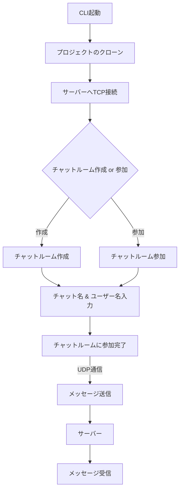

```mermaid
graph TD
    A[CLI起動] --> B[プロジェクトのクローン] --> C[サーバーへTCP接続] --> D{チャットルーム作成 or 参加}
    
    D -- 作成 --> E[チャットルーム作成] --> G[チャット名 & ユーザー名入力]
    D -- 参加 --> F[チャットルーム参加] --> G
    
    G --> H[チャットルームに参加完了]
    
    H -->|UDP通信| I[メッセージ送信] --> J[サーバー] --> K[メッセージ受信]
```
