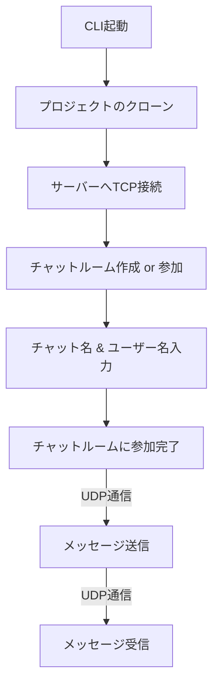

```mermaid
graph TD
    A[CLI起動] --> B[プロジェクトのクローン]
    B --> C[サーバーへTCP接続]
    C --> D[チャットルーム作成 or 参加]
    D --> E[チャット名 & ユーザー名入力]
    E --> F[チャットルームに参加完了]
    F -- UDP通信 --> G[メッセージ送信]
    G -- UDP通信 --> H[メッセージ受信]
```
