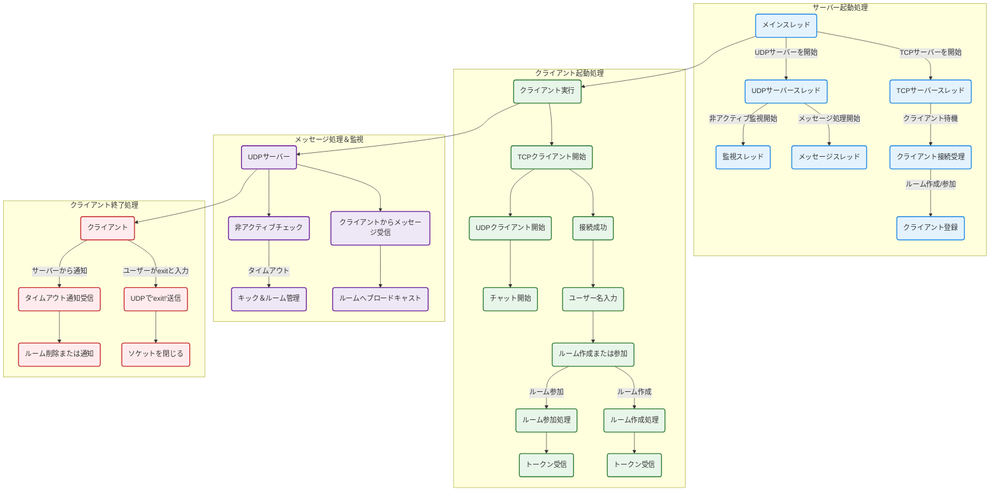

## 🔀処理フロー (フローチャート)

---

## 🖥️ サーバー起動処理

### 🔹 1. メインスレッド

- TCPサーバーとUDPサーバーをそれぞれ別スレッドで起動します。
- 各サーバーの処理は独立しており、並行して動作します。

### 🔹 2. TCPサーバースレッド

- `TCPServer` を起動し、クライアントからの接続を待ち受けます。
- クライアントは以下のどちらかの操作を選択：
  - `1️⃣ ルーム作成`
  - `2️⃣ 既存ルームに参加`
- 処理後、クライアントには **認証トークン** を発行します。

### 🔹 3. UDPサーバースレッド

- `UDPServer` を起動し、以下の2つのスレッドを開始します：
  - 💬 **チャットメッセージの処理**
  - ⏱️ **非アクティブクライアントの監視**

---

## 🧑‍💻 クライアント起動処理

### 🔹 1. TCPクライアント起動

- `TCPClient` を実行してサーバーへ接続。
- ユーザー名と操作（作成 or 参加）を入力します。

#### ✅ ルーム作成（操作コード: 1）
- ユーザーがルーム名を入力。
- サーバーがルームを作成し、トークンを返します。

#### ✅ ルーム参加（操作コード: 2）
- サーバーから利用可能なルーム一覧を取得。
- ユーザーがルーム名を指定して参加し、トークンを受け取ります。

### 🔹 2. UDPクライアント起動

- `UDPClient` を使用して、UDP通信によるチャットを開始。
- メッセージの送受信をスレッドで並行処理します。

---

## 🔁 メッセージ処理 & クライアント監視（UDP）

### 💬 メッセージ受信とブロードキャスト

- クライアントから受信したメッセージを解析：
  - ルーム名
  - クライアントトークン
  - メッセージ本文
- 同じルームの他クライアントに一斉送信（ブロードキャスト）。

### ⏱️ 非アクティブクライアントの検出

- 最終アクティブ時刻を定期チェック（100秒未活動でキック）。
- ホストがタイムアウトした場合、ルームを削除し通知を送信。

---

## ❌ クライアント終了処理

### 🔔 サーバーからの通知で切断

- タイムアウトにより「Timeout!」を受信。
- クライアントは「exit!」を受信し、自動で切断されます。

### 👤 ユーザーによる手動退出

- ユーザーが `exit` を入力することで、UDP経由で退出を通知。
- サーバーは以下を実施：
  - ホスト ➡️ ルーム削除
  - ゲスト ➡️ ルームから除外

