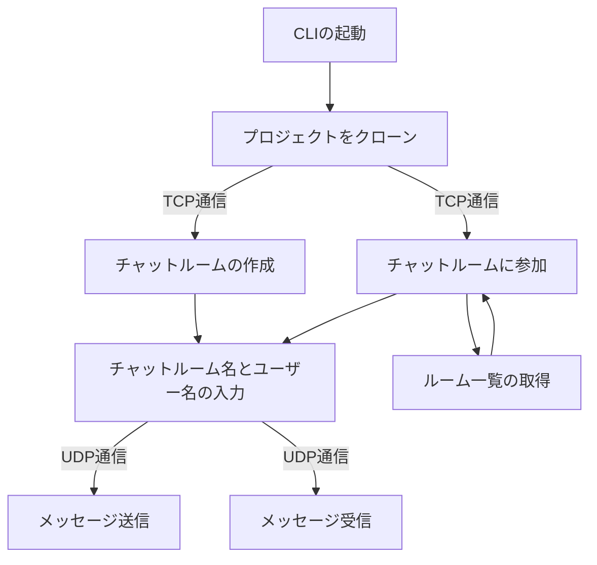

```mermaid
graph TD
    A[CLIの起動] --> B[プロジェクトをクローン]
    B -- TCP通信 --> C[チャットルームの作成]
    B -- TCP通信 --> D[チャットルームに参加]
    
    C --> E[チャットルーム名とユーザー名の入力]
    D --> H[ルーム一覧の取得]
    H --> D
    D --> E
    
    E -- UDP通信 --> I[メッセージ送信]
    E -- UDP通信 --> J[メッセージ受信]
```

