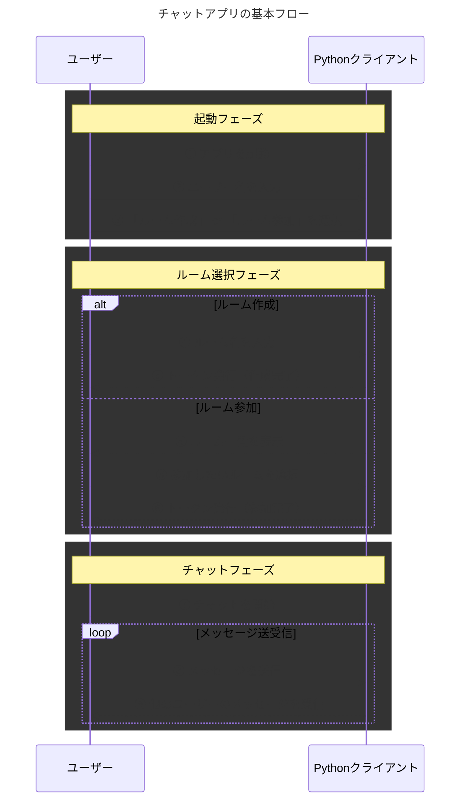
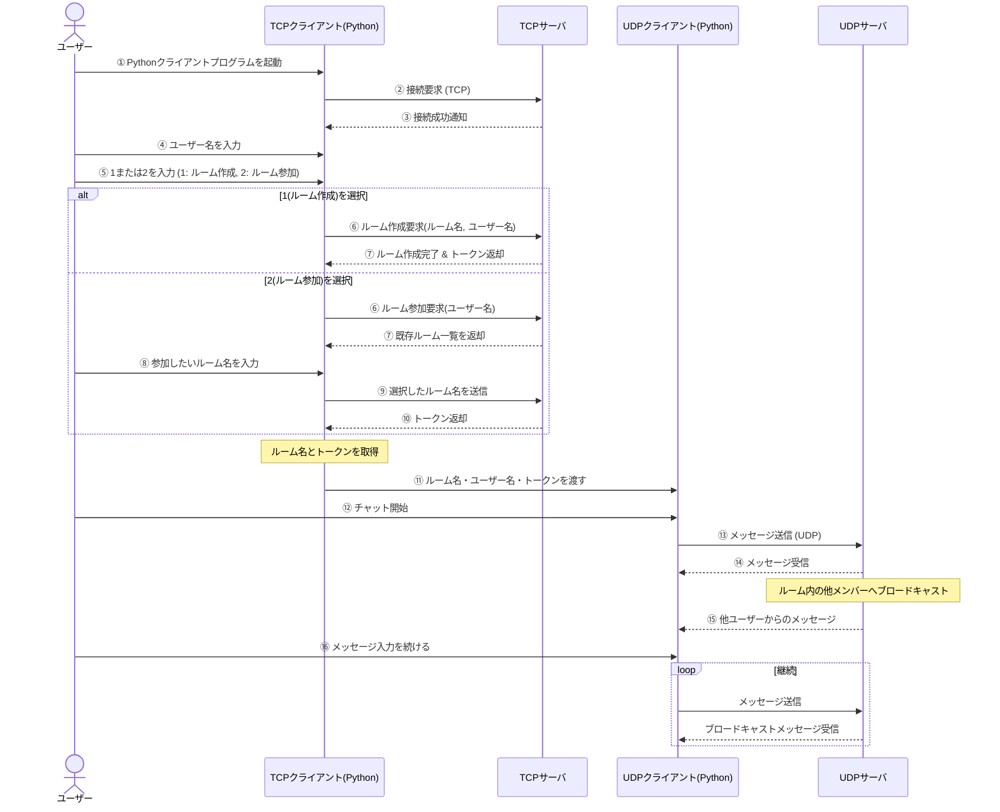

```mermaid
sequenceDiagram
    title チャットアプリの基本フロー

    participant ユーザー
    participant クライアント as Pythonクライアント

    %% === 起動フェーズ ===
    rect
    note over ユーザー,クライアント: 起動フェーズ
        ユーザー ->> クライアント: ① アプリを起動
        ユーザー ->> クライアント: ② ユーザー名を入力
        ユーザー ->> クライアント: ③ 「ルーム作成」 or 「ルーム参加」を選択
    end

    %% === ルーム選択フェーズ ===
    rect
    note over ユーザー,クライアント: ルーム選択フェーズ
        alt ルーム作成
            ユーザー ->> クライアント: ④ ルーム名を入力
            クライアント -->> ユーザー: ⑤ トークン発行（作成完了）
        else ルーム参加
            クライアント -->> ユーザー: ④ ルーム一覧を表示
            ユーザー ->> クライアント: ⑤ 参加したいルームを選択
            クライアント -->> ユーザー: ⑥ トークン発行（参加完了）
        end
    end

    %% === チャットフェーズ ===
    rect
    note over ユーザー,クライアント: チャットフェーズ
        ユーザー ->> クライアント: ⑦ チャットを開始

        loop メッセージ送受信
            ユーザー ->> クライアント: ⑧ メッセージを送信
            クライアント -->> ユーザー: ⑨ 他のユーザーのメッセージを受信
        end
    end


```

```mermaid
sequenceDiagram
    actor ユーザー
    participant TCPクライアント as TCPクライアント(Python)
    participant TCPサーバ as TCPサーバ
    participant UDPクライアント as UDPクライアント(Python)
    participant UDPサーバ as UDPサーバ

    ユーザー->>TCPクライアント: ① Pythonクライアントプログラムを起動
    TCPクライアント->>TCPサーバ: ② 接続要求 (TCP)
    TCPサーバ-->>TCPクライアント: ③ 接続成功通知

    ユーザー->>TCPクライアント: ④ ユーザー名を入力
    ユーザー->>TCPクライアント: ⑤ 1または2を入力 (1: ルーム作成, 2: ルーム参加)

    alt 1(ルーム作成)を選択
        TCPクライアント->>TCPサーバ: ⑥ ルーム作成要求(ルーム名, ユーザー名)
        TCPサーバ-->>TCPクライアント: ⑦ ルーム作成完了 & トークン返却
    else 2(ルーム参加)を選択
        TCPクライアント->>TCPサーバ: ⑥ ルーム参加要求(ユーザー名)
        TCPサーバ-->>TCPクライアント: ⑦ 既存ルーム一覧を返却
        ユーザー->>TCPクライアント: ⑧ 参加したいルーム名を入力
        TCPクライアント->>TCPサーバ: ⑨ 選択したルーム名を送信
        TCPサーバ-->>TCPクライアント: ⑩ トークン返却
    end

    note over TCPクライアント: ルーム名とトークンを取得
    
    TCPクライアント->>UDPクライアント: ⑪ ルーム名・ユーザー名・トークンを渡す

    ユーザー->>UDPクライアント: ⑫ チャット開始
    UDPクライアント->>UDPサーバ: ⑬ メッセージ送信 (UDP)
    UDPサーバ-->>UDPクライアント: ⑭ メッセージ受信

    note over UDPサーバ: ルーム内の他メンバーへブロードキャスト

    UDPサーバ-->>UDPクライアント: ⑮ 他ユーザーからのメッセージ
    ユーザー->>UDPクライアント: ⑯ メッセージ入力を続ける
    loop 継続
        UDPクライアント->>UDPサーバ: メッセージ送信
        UDPサーバ-->>UDPクライアント: ブロードキャストメッセージ受信
    end
```

