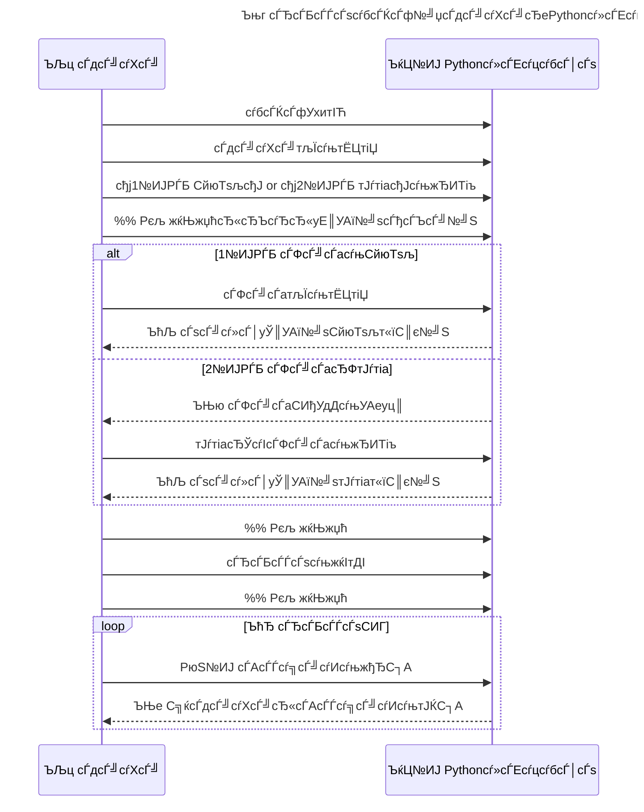
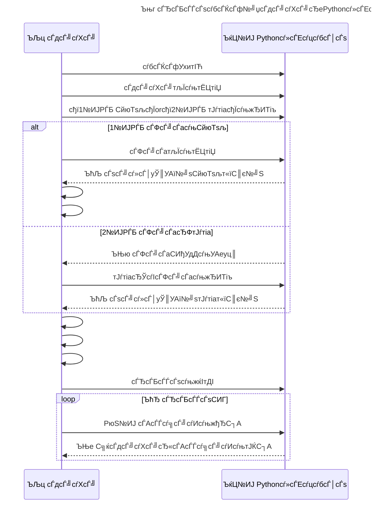
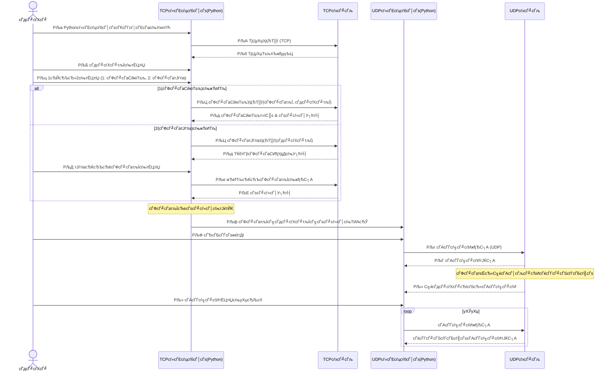

```mermaid
sequenceDiagram
    title ­Ъњг сЃЂсЃБсЃЃсЃѕсѓбсЃЌсЃф№╝џсЃдсЃ╝сѓХсЃ╝сЂеPythonсѓ»сЃЕсѓцсѓбсЃ│сЃѕсЂ«сѓёсѓісЂесѓі

    participant сЃдсЃ╝сѓХсЃ╝ as ­ЪЉц сЃдсЃ╝сѓХсЃ╝
    participant сѓ»сЃЕсѓцсѓбсЃ│сЃѕ as ­ЪќЦ№ИЈ Pythonсѓ»сЃЕсѓцсѓбсЃ│сЃѕ


    сЃдсЃ╝сѓХсЃ╝ ->> сѓ»сЃЕсѓцсѓбсЃ│сЃѕ: сѓбсЃЌсЃфУхитІЋ
    сЃдсЃ╝сѓХсЃ╝ ->> сѓ»сЃЕсѓцсѓбсЃ│сЃѕ: сЃдсЃ╝сѓХсЃ╝тљЇсѓњтЁЦтіЏ
    сЃдсЃ╝сѓХсЃ╝ ->> сѓ»сЃЕсѓцсѓбсЃ│сЃѕ: сђј1№ИЈРЃБ СйюТѕљсђЈ or сђј2№ИЈРЃБ тЈѓтіасђЈсѓњжЂИТіъ

    сЃдсЃ╝сѓХсЃ╝ ->> сѓ»сЃЕсѓцсѓбсЃ│сЃѕ:   %% Рєљ жќЊжџћсЂ«сЂЪсѓЂсЂ«уЕ║УАї№╝ѕсЃђсЃЪсЃ╝№╝Ѕ


    alt 1№ИЈРЃБ сЃФсЃ╝сЃасѓњСйюТѕљ

        сЃдсЃ╝сѓХсЃ╝ ->> сѓ»сЃЕсѓцсѓбсЃ│сЃѕ: сЃФсЃ╝сЃатљЇсѓњтЁЦтіЏ
        сѓ»сЃЕсѓцсѓбсЃ│сЃѕ -->> сЃдсЃ╝сѓХсЃ╝: ­ЪћЉ сЃѕсЃ╝сѓ»сЃ│уЎ║УАї№╝ѕСйюТѕљт«їС║є№╝Ѕ

    else 2№ИЈРЃБ сЃФсЃ╝сЃасЂФтЈѓтіа

        сѓ»сЃЕсѓцсѓбсЃ│сЃѕ -->> сЃдсЃ╝сѓХсЃ╝: ­ЪЊю сЃФсЃ╝сЃаСИђУдДсѓњУАеуц║
        сЃдсЃ╝сѓХсЃ╝ ->> сѓ»сЃЕсѓцсѓбсЃ│сЃѕ: тЈѓтіасЂЎсѓІсЃФсЃ╝сЃасѓњжЂИТіъ
        сѓ»сЃЕсѓцсѓбсЃ│сЃѕ -->> сЃдсЃ╝сѓХсЃ╝: ­ЪћЉ сЃѕсЃ╝сѓ»сЃ│уЎ║УАї№╝ѕтЈѓтіат«їС║є№╝Ѕ
    end

    сЃдсЃ╝сѓХсЃ╝ ->> сѓ»сЃЕсѓцсѓбсЃ│сЃѕ:   %% Рєљ жќЊжџћ


    сЃдсЃ╝сѓХсЃ╝ ->> сѓ»сЃЕсѓцсѓбсЃ│сЃѕ: сЃЂсЃБсЃЃсЃѕсѓњжќІтДІ

    сЃдсЃ╝сѓХсЃ╝ ->> сѓ»сЃЕсѓцсѓбсЃ│сЃѕ:   %% Рєљ жќЊжџћ


    loop ­ЪћЂ сЃЂсЃБсЃЃсЃѕСИГ

        сЃдсЃ╝сѓХсЃ╝ ->> сѓ»сЃЕсѓцсѓбсЃ│сЃѕ: РюЅ№ИЈ сЃАсЃЃсѓ╗сЃ╝сѓИсѓњжђЂС┐А

        сѓ»сЃЕсѓцсѓбсЃ│сЃѕ -->> сЃдсЃ╝сѓХсЃ╝: ­ЪЊе С╗ќсЃдсЃ╝сѓХсЃ╝сЂ«сЃАсЃЃсѓ╗сЃ╝сѓИсѓњтЈЌС┐А
    end


```

```mermaid
sequenceDiagram
    title ­Ъњг сЃЂсЃБсЃЃсЃѕсѓбсЃЌсЃф№╝џсЃдсЃ╝сѓХсЃ╝сЂеPythonсѓ»сЃЕсѓцсѓбсЃ│сЃѕсЂ«сѓёсѓісЂесѓі

    participant сЃдсЃ╝сѓХсЃ╝ as ­ЪЉц сЃдсЃ╝сѓХсЃ╝
    participant сѓ»сЃЕсѓцсѓбсЃ│сЃѕ as ­ЪќЦ№ИЈ Pythonсѓ»сЃЕсѓцсѓбсЃ│сЃѕ

    %% === ­Ъџђ УхитІЋсЃЋсѓДсЃ╝сѓ║ ===
    сЃдсЃ╝сѓХсЃ╝->>сѓ»сЃЕсѓцсѓбсЃ│сЃѕ: сѓбсЃЌсЃфУхитІЋ
    сЃдсЃ╝сѓХсЃ╝->>сѓ»сЃЕсѓцсѓбсЃ│сЃѕ: сЃдсЃ╝сѓХсЃ╝тљЇсѓњтЁЦтіЏ
    сЃдсЃ╝сѓХсЃ╝->>сѓ»сЃЕсѓцсѓбсЃ│сЃѕ: сђї1№ИЈРЃБ СйюТѕљсђЇorсђї2№ИЈРЃБ тЈѓтіасђЇсѓњжЂИТіъ

    %% === ­ЪЈа сЃФсЃ╝сЃажЂИТіъсЃЋсѓДсЃ╝сѓ║ ===
    alt 1№ИЈРЃБ сЃФсЃ╝сЃасѓњСйюТѕљ
        сЃдсЃ╝сѓХсЃ╝->>сѓ»сЃЕсѓцсѓбсЃ│сЃѕ: сЃФсЃ╝сЃатљЇсѓњтЁЦтіЏ
        сѓ»сЃЕсѓцсѓбсЃ│сЃѕ-->>сЃдсЃ╝сѓХсЃ╝: ­ЪћЉ сЃѕсЃ╝сѓ»сЃ│уЎ║УАї№╝ѕСйюТѕљт«їС║є№╝Ѕ

        %% СйюТѕљсЂетЈѓтіасЂ«жќЊсЂФсѓ╣сЃџсЃ╝сѓ╣
        сЃдсЃ╝сѓХсЃ╝->>сЃдсЃ╝сѓХсЃ╝:
        сЃдсЃ╝сѓХсЃ╝->>сЃдсЃ╝сѓХсЃ╝:

    else 2№ИЈРЃБ сЃФсЃ╝сЃасЂФтЈѓтіа
        сѓ»сЃЕсѓцсѓбсЃ│сЃѕ-->>сЃдсЃ╝сѓХсЃ╝: ­ЪЊю сЃФсЃ╝сЃаСИђУдДсѓњУАеуц║
        сЃдсЃ╝сѓХсЃ╝->>сѓ»сЃЕсѓцсѓбсЃ│сЃѕ: тЈѓтіасЂЎсѓІсЃФсЃ╝сЃасѓњжЂИТіъ
        сѓ»сЃЕсѓцсѓбсЃ│сЃѕ-->>сЃдсЃ╝сѓХсЃ╝: ­ЪћЉ сЃѕсЃ╝сѓ»сЃ│уЎ║УАї№╝ѕтЈѓтіат«їС║є№╝Ѕ
    end

    %% altсЃќсЃГсЃЃсѓ»сЂесЃЂсЃБсЃЃсЃѕсЂ«жќЊсЂФуЕ║УАїТї┐тЁЦ
    сЃдсЃ╝сѓХсЃ╝->>сЃдсЃ╝сѓХсЃ╝:
    сЃдсЃ╝сѓХсЃ╝->>сЃдсЃ╝сѓХсЃ╝:
    сЃдсЃ╝сѓХсЃ╝->>сЃдсЃ╝сѓХсЃ╝:

    %% === ­Ъњг сЃЂсЃБсЃЃсЃѕсЃЋсѓДсЃ╝сѓ║ ===
    сЃдсЃ╝сѓХсЃ╝->>сѓ»сЃЕсѓцсѓбсЃ│сЃѕ: сЃЂсЃБсЃЃсЃѕсѓњжќІтДІ

    loop ­ЪћЂ сЃЂсЃБсЃЃсЃѕСИГ
        сЃдсЃ╝сѓХсЃ╝->>сѓ»сЃЕсѓцсѓбсЃ│сЃѕ: РюЅ№ИЈ сЃАсЃЃсѓ╗сЃ╝сѓИсѓњжђЂС┐А
        сѓ»сЃЕсѓцсѓбсЃ│сЃѕ-->>сЃдсЃ╝сѓХсЃ╝: ­ЪЊе С╗ќсЃдсЃ╝сѓХсЃ╝сЂ«сЃАсЃЃсѓ╗сЃ╝сѓИсѓњтЈЌС┐А
    end
```

```mermaid
sequenceDiagram
    actor сЃдсЃ╝сѓХсЃ╝
    participant TCPсѓ»сЃЕсѓцсѓбсЃ│сЃѕ as TCPсѓ»сЃЕсѓцсѓбсЃ│сЃѕ(Python)
    participant TCPсѓхсЃ╝сЃљ as TCPсѓхсЃ╝сЃљ
    participant UDPсѓ»сЃЕсѓцсѓбсЃ│сЃѕ as UDPсѓ»сЃЕсѓцсѓбсЃ│сЃѕ(Python)
    participant UDPсѓхсЃ╝сЃљ as UDPсѓхсЃ╝сЃљ

    сЃдсЃ╝сѓХсЃ╝->>TCPсѓ»сЃЕсѓцсѓбсЃ│сЃѕ: РЉа Pythonсѓ»сЃЕсѓцсѓбсЃ│сЃѕсЃЌсЃГсѓ░сЃЕсЃасѓњУхитІЋ
    TCPсѓ»сЃЕсѓцсѓбсЃ│сЃѕ->>TCPсѓхсЃ╝сЃљ: РЉА ТјЦуХџУдЂТ▒ѓ (TCP)
    TCPсѓхсЃ╝сЃљ-->>TCPсѓ»сЃЕсѓцсѓбсЃ│сЃѕ: РЉб ТјЦуХџТѕљтіЪжђџуЪЦ

    сЃдсЃ╝сѓХсЃ╝->>TCPсѓ»сЃЕсѓцсѓбсЃ│сЃѕ: РЉБ сЃдсЃ╝сѓХсЃ╝тљЇсѓњтЁЦтіЏ
    сЃдсЃ╝сѓХсЃ╝->>TCPсѓ»сЃЕсѓцсѓбсЃ│сЃѕ: РЉц 1сЂЙсЂЪсЂ»2сѓњтЁЦтіЏ (1: сЃФсЃ╝сЃаСйюТѕљ, 2: сЃФсЃ╝сЃатЈѓтіа)

    alt 1(сЃФсЃ╝сЃаСйюТѕљ)сѓњжЂИТіъ
        TCPсѓ»сЃЕсѓцсѓбсЃ│сЃѕ->>TCPсѓхсЃ╝сЃљ: РЉЦ сЃФсЃ╝сЃаСйюТѕљУдЂТ▒ѓ(сЃФсЃ╝сЃатљЇ, сЃдсЃ╝сѓХсЃ╝тљЇ)
        TCPсѓхсЃ╝сЃљ-->>TCPсѓ»сЃЕсѓцсѓбсЃ│сЃѕ: РЉд сЃФсЃ╝сЃаСйюТѕљт«їС║є & сЃѕсЃ╝сѓ»сЃ│У┐ћтЇ┤
    else 2(сЃФсЃ╝сЃатЈѓтіа)сѓњжЂИТіъ
        TCPсѓ»сЃЕсѓцсѓбсЃ│сЃѕ->>TCPсѓхсЃ╝сЃљ: РЉЦ сЃФсЃ╝сЃатЈѓтіаУдЂТ▒ѓ(сЃдсЃ╝сѓХсЃ╝тљЇ)
        TCPсѓхсЃ╝сЃљ-->>TCPсѓ»сЃЕсѓцсѓбсЃ│сЃѕ: РЉд ТЌбтГўсЃФсЃ╝сЃаСИђУдДсѓњУ┐ћтЇ┤
        сЃдсЃ╝сѓХсЃ╝->>TCPсѓ»сЃЕсѓцсѓбсЃ│сЃѕ: РЉД тЈѓтіасЂЌсЂЪсЂёсЃФсЃ╝сЃатљЇсѓњтЁЦтіЏ
        TCPсѓ»сЃЕсѓцсѓбсЃ│сЃѕ->>TCPсѓхсЃ╝сЃљ: РЉе жЂИТіъсЂЌсЂЪсЃФсЃ╝сЃатљЇсѓњжђЂС┐А
        TCPсѓхсЃ╝сЃљ-->>TCPсѓ»сЃЕсѓцсѓбсЃ│сЃѕ: РЉЕ сЃѕсЃ╝сѓ»сЃ│У┐ћтЇ┤
    end

    note over TCPсѓ»сЃЕсѓцсѓбсЃ│сЃѕ: сЃФсЃ╝сЃатљЇсЂесЃѕсЃ╝сѓ»сЃ│сѓњтЈќтЙЌ
    
    TCPсѓ»сЃЕсѓцсѓбсЃ│сЃѕ->>UDPсѓ»сЃЕсѓцсѓбсЃ│сЃѕ: РЉф сЃФсЃ╝сЃатљЇсЃ╗сЃдсЃ╝сѓХсЃ╝тљЇсЃ╗сЃѕсЃ╝сѓ»сЃ│сѓњТИАсЂЎ

    сЃдсЃ╝сѓХсЃ╝->>UDPсѓ»сЃЕсѓцсѓбсЃ│сЃѕ: РЉФ сЃЂсЃБсЃЃсЃѕжќІтДІ
    UDPсѓ»сЃЕсѓцсѓбсЃ│сЃѕ->>UDPсѓхсЃ╝сЃљ: РЉг сЃАсЃЃсѓ╗сЃ╝сѓИжђЂС┐А (UDP)
    UDPсѓхсЃ╝сЃљ-->>UDPсѓ»сЃЕсѓцсѓбсЃ│сЃѕ: РЉГ сЃАсЃЃсѓ╗сЃ╝сѓИтЈЌС┐А

    note over UDPсѓхсЃ╝сЃљ: сЃФсЃ╝сЃатєЁсЂ«С╗ќсЃАсЃ│сЃљсЃ╝сЂИсЃќсЃГсЃ╝сЃЅсѓГсЃБсѓ╣сЃѕ

    UDPсѓхсЃ╝сЃљ-->>UDPсѓ»сЃЕсѓцсѓбсЃ│сЃѕ: РЉ« С╗ќсЃдсЃ╝сѓХсЃ╝сЂІсѓЅсЂ«сЃАсЃЃсѓ╗сЃ╝сѓИ
    сЃдсЃ╝сѓХсЃ╝->>UDPсѓ»сЃЕсѓцсѓбсЃ│сЃѕ: РЉ» сЃАсЃЃсѓ╗сЃ╝сѓИтЁЦтіЏсѓњуХџсЂЉсѓІ
    loop уХЎуХџ
        UDPсѓ»сЃЕсѓцсѓбсЃ│сЃѕ->>UDPсѓхсЃ╝сЃљ: сЃАсЃЃсѓ╗сЃ╝сѓИжђЂС┐А
        UDPсѓхсЃ╝сЃљ-->>UDPсѓ»сЃЕсѓцсѓбсЃ│сЃѕ: сЃќсЃГсЃ╝сЃЅсѓГсЃБсѓ╣сЃѕсЃАсЃЃсѓ╗сЃ╝сѓИтЈЌС┐А
    end
```

